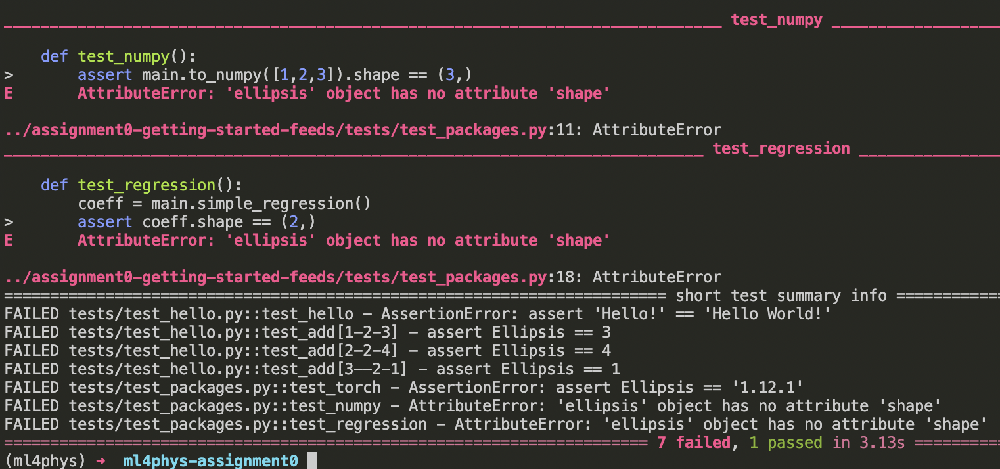
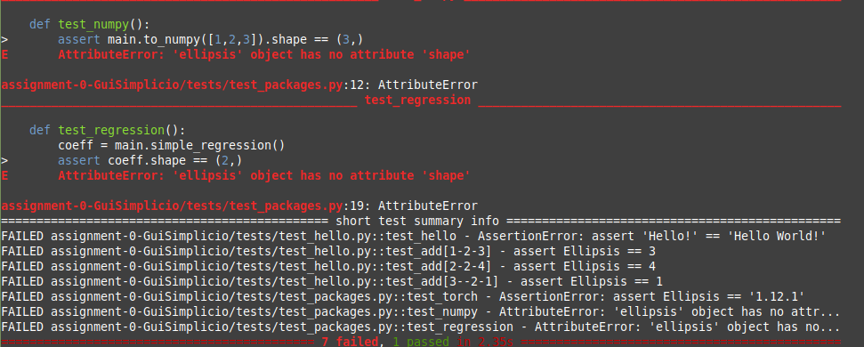
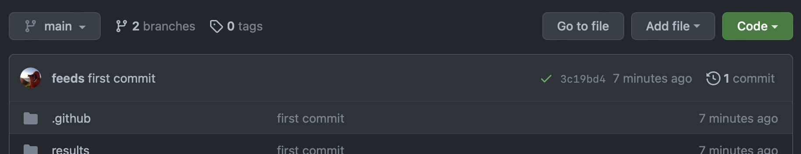
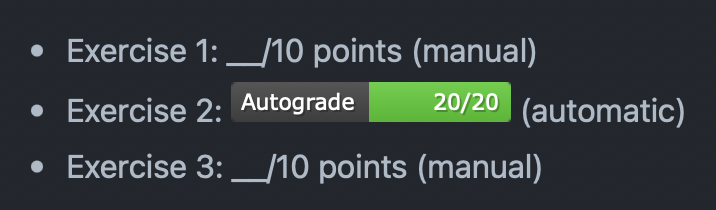
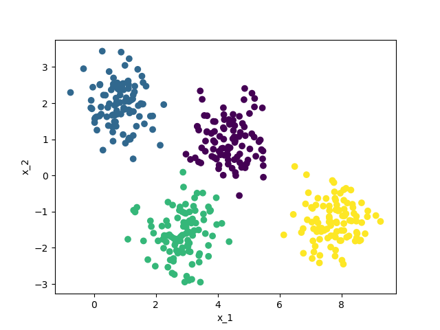

# Assignment 0 - Warming Up

Note, this assignment is not counting towards the final grade. But, in order to be prepared for the graded assignments you should get full points on this exercise.

> For this exercise it is totally fine if you team up and help each other!

## Grade
We will grade some parts of the homeworks automatically and some manually. So it is neccessary to do *all* the exercises lined out below, don't rely on all the tests being green!

- Exercise 1: __/10 points (manual)
- Exercise 2: [](../../actions) (automatic)
- Exercise 3: __/10 points (manual)

While the autograde badge will not show locally on your computer, you can look at it on the landing page of the github repository.

## Exercise 1: Set up Git and Python on your computer

### Git

Git is a version control control system, it is a source software for distributed version control: tracking changes in any set of files, usually used for coordinating work among programmers collaboratively developing source code during software development [(Wikipedia)](https://en.wikipedia.org/wiki/Git).

We promised you that you will learn some relevant machine learning tools... well here it starts! Version control and code maintaining is a basic skill.

(If you know about git and github already just clone the repository locally and skip to the section on python)

1. Install git via [https://git-scm.com/downloads](https://git-scm.com/downloads). For windows you might want [git bash](https://gitforwindows.org). If you prefer GUI interfaces to the command line tool, check [github dektop](https://desktop.github.com).
2. Clone your personal assignment0 repository locally on your PC (if that sounds gibberish to you, check this for a [short intro to git](https://www.freecodecamp.org/news/learn-the-basics-of-git-in-under-10-minutes-da548267cc91/)). Essentially you need to run the command that you can paste when you go to the top of this webpage and press the green button `Code`.

If you made it until here, have git installed and a code editor ready, its time to look at the code files of this repository locally on your computer.

### Running Python locally

For the graded exercises you will be required to run Python locally.
Sometimes setting everything up to work correctly on YOUR computer is a bit of a pain as the default pyhton interpreter and packages vary from system to system.
With virtual enviroments and their manager, we can all work with exactly the same interpreter locally. 
Such an environemnt encapsulates all the packages you need for a specific project, like this course!
If you are curious, you can find more information about the package manager **conda** that we are using [here](https://whiteboxml.com/blog/the-definitive-guide-to-python-virtual-environments-with-conda).

1. Install [conda](https://conda.io/projects/conda/en/latest/user-guide/install/index.html).
2. Install a local development environment like [VS code](https://code.visualstudio.com), for this we specifically recommend also installing the [python extensions](https://code.visualstudio.com/docs/languages/python).
   
#### Create a local python environment called ml4phys

In the root directory of the repository in the terminal, run `conda env create -n ml4phys --file environment.yml`, this might take a couple of minutes. It installs the correct python environment version and packages for your use.

To activate this interpreter you should call `conda activate ml4phys` in the terminal at root directory of the repository.
Then, your terminal should look like the something like following, where at the start of line in brackets the active environment is indicated.

```bash
(base) ➜  ml4phys-assignment0: conda activate ml4phys   
(ml4phys) ➜  ml4phys-assignment0: 
```

This means that when you run `python` now, all the packages specified in `environment.yml` are available to you!

#### Run python tests

In parts we use automated grading, and this means running software tests on your code. 
Tests are small functions living in the `tests\` folder that call other functions from your code and check whether they give the right output for a given input.

You can see if the tests in this repository are passing or failing, by running `PYTHONPATH=. pytest` in the root directory - don't forget to actiavte the `ml4phys` environment.

### Show your success

To get the 10 points for this exercise, take screenshot of the failing tests and save it as `results/my_screenshot.png`.
Add the resulting file and commit it with a commit message saying `"I ran pytests locally!"`, and push it to github.

> Only pushed code, i.e. code that is viewable on `github.com/SPOC/ml4phys-assignment0-<yourusesrname>` before the deadline, will count to your grade. 

Expected                   |  Yours
:-------------------------:|:-------------------------:
|


## Exercise 2: Fix the tests
The `pytest` function is showing failing tests right now because the code in `main.py` is not doing what it is supposed to do. Fix the tests by looking at the instructions in the function `hello_world, add, torch_version, to_numpy, simple_regression` in `main.py`. You might want to look at the documentation of the different packages used and check out the test files in the `tests\` folder to make the tests pass.

Recall that to run the tests you use
`conda activate ml4phys`
`PYTHONPATH=. pytest`
in the terminal in the root directory of the repository.

> :warning: You might notice that we do not hide the tests from you, you can look at them, and even commit modified versions.
You could feel smart and delete the tests. Great, now you get all the assignment points...
Or just copy the test synatx into your own code. Whohoo, yet another way to obtain all the points without much work!
Well, DON'T try either. Because we will check your code for this and if we find this, we consider it as cheating.

After fixing all the tests you can 

1. Commit the corrected code to github, and check that online the autograding badge shows full points. 

It might take a couple of minutes to complete the online tests but in the end it should look like this (Note the green checkmark that tells you that the online grading has succesfully finished).

And the top of this readme online should show



## Exercise 3: Plot a figure

Sometimes we will ask you to plot figures, like loss curves and datasets. 
To get full points, modify the function `plot_gaussian_data()` in `main.py`, so that it looks like what is shown below in the expected column. Note the labelled axes!

In order to produce the plot, again use 
`conda activate ml4phys` and then 
`python main.py`, which runs all the code under the line `if __name__: '__main__':` in the `main.py` file.


Expected                   |  Yours
:-------------------------:|:-------------------------:
|


